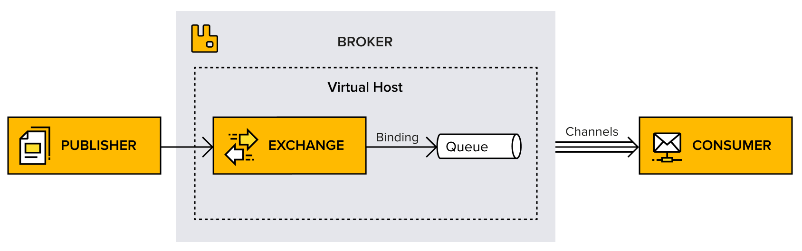

# Ch1

# General Nots

The most common use for Rabbitmq is single producer single consumer.

- Two main uses for rabbitmq:
    1. Message Queueing (Frequent communication)
    2. Events and tasks (Acting as Task queue for the slow operations.) [as we used Redis in Our Edu]

# RabbitMQ Core Concepts

## 1. Broker

broker is a piece of software that sends and receives messages from/to apps

## 2. Vhost

exists within the broker.

- It is a way to separate apps that are using the same Rabbitmq instance
- It can be used to separate the dev and staging environments.
- users, exchanges, queues …etc are isolated on one vhost.

---

## 3. Connection

Rabbitmq connection is a physical network (TCP ) connection between the app and the broker.

Opening a new connection in Rabbitmq is costly and even costly when using TLS

### A sample message published will take:

- AMQP Open Connection: 7 TCP packages (handshaking)
- AMQP Open Channel: 2 TCP packages
- AMQP Publish: 1 TCP package (more for the larger messages)
- AMQP Close Channel: 2 TCP packages
- Connection: 2 TCP packages

**Total** 14 - 19 Packages (plus Acks)

---

## 4. Channels

- channels are a virtual connection inside the main connection, it reuses the connection forgoing the need to reauthorize and open a new TCP stream.
- All operations performed by a client happen on a channel
    - queues are declared on channels
    - Messages are published and consumed over the channels
- Many channels can be established  within a single connection
- Even though channel instances are technically **thread-safe** but its ***strongly recommended to avoid having several threads that are using the same channel concurrently.***
- It is of crucial importance that the consumer acknowledges the
messages on the same channel as they were received because not doing so will raise an
error.
    
    ---
    

## 5. Exchanges

exchanges are the entities that are responsible for applying the routing rules (binding to the queue) and making sure that messages are reaching their final destination.

### **Binding**

- **Binding ⇒** is a virtual link between an exchange and a queue within the broker.
- it enables the message to flow from an exchange to a queue.

### Queues

a queue is a sequence of messages

- a queue needs to be bound to at least one exchange to be able to receive messages.

### Exchange types / Routing Rules

The message ends up in a queue which is defined by the routing roles or change types:

1. Direct ⇒ point-to-point 
2. Topic ⇒ publish/subscribe
3. Fanout ⇒ Multicast
4. Header exchange.