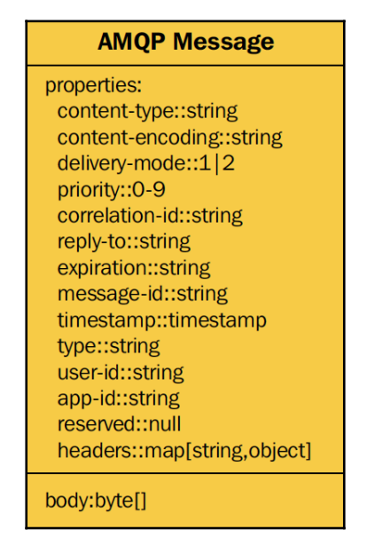

# Ch 2

## Exchange and Queue Declaration

- Declaring queues or exchanges are **idempotent** when the same properties are used so its safe for the queues to be declared and bound to the exchange over and over again
- It's the sender's responsibility to ensure the addressee’s queue exists (if you want to be sure the message will not get lost).
    - so the sender should declare the queue every time he sends a message.

<aside>
💡 This is a common pattern with AMQP when there is no strong **happens-before** relationship between events. **Re-declaration** is the way to go.
Conversely, the **check-then-act** pattern is discouraged; trying to check the
pre-existence of an exchange or a queue does not guarantee success in the
a typical distributed environment where AMQP is used.

</aside>

- but also you can declare the exchange/queue on the consumer side.
- A queue can have multiple consumers (unless the **exclusive** tag is used)

---

## Message Persistence

### Ensure that messages are not lost by:

1.  declaring a queue as **durable**  (this is a queue property)
2. and setting the message delivery mode to **persistent**. (this is a message property)
3. **`Ack`** after the consumer finishes its process.
    1. When sending `Nack` the broker sends it back to the queue to be sent again

- Persistent messages will be saved on disk until they get acknowledged

<aside>
⛔ Do not confuse exchange and queue durability with message persistence;
non-persistent messages stored in a durable queue will be gone after a
broker restart, leaving you with an empty queue.

Additionally, persistent messages in a non-persistent queue will be gone
after a broker restart, also leaving you with an empty queue.

</aside>

### AMQP message structure

---

### General

<aside>
💡 With enough RAM, RabbitMQ can deal with hundreds of queues and
bindings without a problem, so multiple queues are not an issue.

</aside>

- The channels cant be **reopened** if something goes wrong, they only can be **recreated from scratch**
- Each channel can have multiple consumers
- Channels are full-duplex, so they can be used to publish and consume at the same time.
- Each consumer uses server resources, so it's best to make sure not to use too many consumers
    - this is the problem we had in our edu
- You can configure the maximum number of channels per connection by using channel_max from the RabbitMQ dashboard.